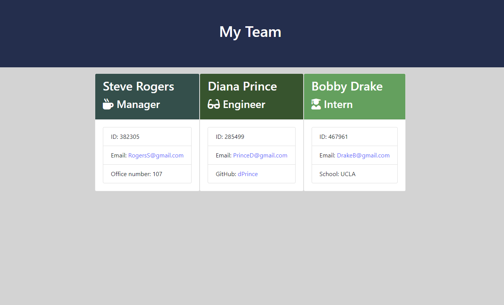
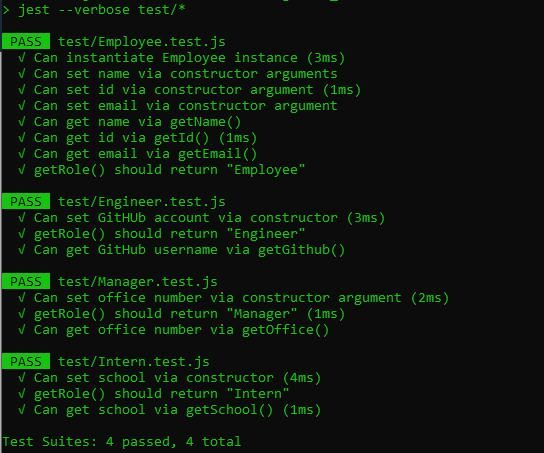

# Team Profile Generator
  
  ## Table of Contents
  [Description](#description)

  [Installation](#installation)

  [Usage](#usage)

  [License](#license)

  [Tests](#tests)

  [Notes](#notes)

  [Questions](#questions)
  ## Description
  This program will quickly generate an html webpage that displays an Engineering Team (Manager, Engineers, Interns) built from user-input
  ## Installation
  In your terminal:
  ```bash
  npm install
  npm install inquirer
  npm install jest
  ```
  ## Usage
  The user will be asked a series of questions regarding an employee's Name, ID #, Email, and whether their role in the team is a Manager, Engineer, or Intern. Managers will be asked what office number they are in; Engineers will be asked their github username; Interns will be asked what school they are attending. Follow the prompts until you are notified that your file has been generated. The file can be opened by opening the team.html file found in the output folder. An example is shown below<br>
  
  ## License
  MIT
  ## Tests
  ```bash
  npm run tests
  ```
  This will run tests to ensure the classes and subclasses are collecting information as expected. Jest must be installed before tests can run.
  ## Notes
  Program passes all tests<br>
  <br>
  Changes were made to the templates to allow for additional styling of the cards if needed within the style.css file. The Manager card can be called through the "m-cardHeader" and "m-cardBody" classes. Engineer and Intern cards follow the same formatting, with the "m" being traded for "e" and "i" respectively.
  ## Questions
  For any further questions, you may contact me at:
  
github: http://github.com/mgmoreno22